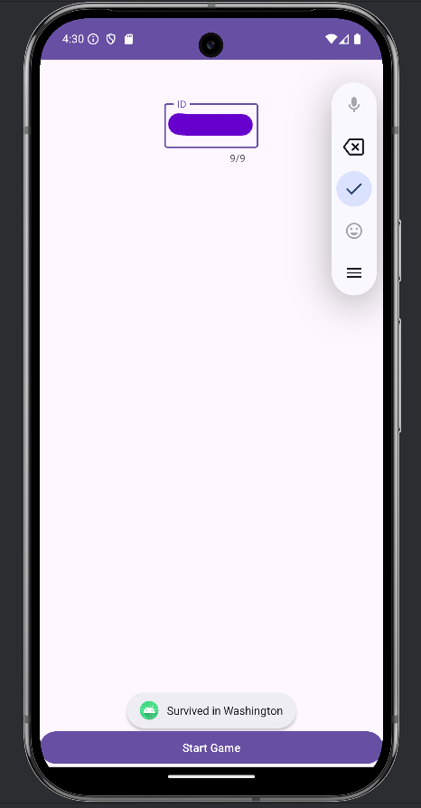

# SurviveGame – Reverse Engineering Project

**Course:** Mobile Security  
**Assignment:** Reverse Engineering APK  


---
## Introduction
SurviveGame is a mobile game developed as part of a mobile security course, as part of a learning assignment that aimed to reverse engineer a given APK file. The project involved restoring missing components and fixing hidden bugs, until the application was fully operational. The goal of the game is to navigate through different stages using arrows and find your way back to your city. Upon starting the game, the player must enter a unique identifier (ID) that affects the course of the game and the stages are lengthy.
## Objective

We were provided with an APK file of a mobile game called **SurviveGame**. The goal of the game is:

> "Find a way to survive and reach your city."

To win, the user must enter a valid 9-digit ID, and then press directional arrows in the correct order derived from internal logic in the game. If successful, a toast message appears:  
**🏙️ "Survived in <City>"**

---

## Reverse Engineering Process

### APK Decompilation
I used [JADX](https://github.com/skylot/jadx) and [javadecompilers.com](http://www.javadecompilers.com/apk) to analyze the original APK.

### Code Structure Analysis
I identified the following key components:

- **Activities:**
    - `Activity_Menu`: Entry screen where the user inputs the ID number.
    - `Activity_Game`: Handles the gameplay logic and arrow navigation.

- **Resources Missing:**
    - Layouts: `activity_menu.xml`, `activity_game.xml`
    - Icons & drawables
    - String values (especially URL string)

- **Manifest File (`AndroidManifest.xml`):**
    - **Package name**: `com.example.survivegame`
    - **Permissions**: Required `android.permission.INTERNET`
    - **Activities**:
        - `Activity_Menu`: Launcher activity.
        - `Activity_Game`: Declared with portrait orientation.
    - Issues:
        - Missing `android:exported="true"` attribute in launcher activity.
        - Invalid auto-generated attributes such as `android:platformBuildVersionCode` and `platformBuildVersionName` were present and removed.

- **SDK Versions:**
    - `minSdkVersion`: 24
    - `targetSdkVersion`: originally 30 → updated to 34 for build compatibility.
---

### Resource Inspection

I examined the following directories and reconstructed missing assets:

- `res/layout`: Rebuilt `activity_menu.xml` and `activity_game.xml` layout files.
- `res/drawable`: Re-added image assets for navigation arrows.
- `res/values`: Reconstructed strings (`strings.xml`), styles, and colors. Restored the URL used to fetch the list of cities.

---
### Logic Analysis
- The ID must be **9 digits** long.
- Each digit is parsed and transformed into a direction:

| Digit % 4 | Direction |  
|-----------|-----------|  
| 0         | Left (←)  |  
| 1         | Right (→) |  
| 2         | Up (↑)    |  
| 3         | Down (↓)  |

- The direction array is created using:
```java
steps[i] = Integer.parseInt(String.valueOf(id.charAt(i))) % 4;
```
- The 8th digit (index 7) determines the final city:
```java
String state = data.split(",")[Integer.parseInt(String.valueOf(id.charAt(7)))];
```
- The city list is fetched from:
```xml
<string name="url">https://pastebin.com/raw/T67TVJG9</string>
```

### Issues Found & Fixes Applied

| Problem                                     | Fix                                                          |
| ------------------------------------------- | ------------------------------------------------------------ |
| `android:exported` missing in main activity | ✅ Added `android:exported="true"`                            |
| Outdated `targetSdkVersion` (30)            | ✅ Updated to 34                                              |
| Corrupted URL string                        | ✅ Re-added correct URL to `strings.xml`                      |
| Invalid manifest attributes                 | ✅ Removed `android:platformBuildVersionCode/Name`            |
| Layouts and drawables missing               | ✅ Rebuilt `activity_menu.xml` and `activity_game.xml`        |
| Toast message unclear                       | ✅ Updated toast to: `"Survived in <City>"` or `"You Failed"` |

### Example Gameplay
| Digit | Digit % 4 | Direction |
| ----- | --------- | --------- |
| 3     | 3         | Down (↓)  |
| 2     | 2         | Up (↑)    |
| 2     | 2         | Up (↑)    |
| 6     | 2         | Up (↑)    |
| 4     | 0         | Left (←)  |
| 3     | 3         | Down (↓)  |
| 0     | 0         | Left (←)  |
| 7     | 3         | Down (↓)  |
| 3     | 3         | Down (↓)  |

### Correct Sequence to Press
↓ ↑ ↑ ↑ ← ↓ ← ↓ ↓
### Result City
Washington


